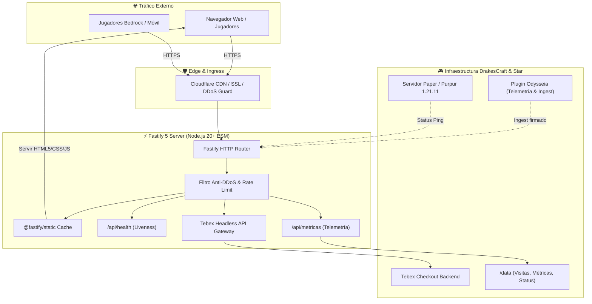
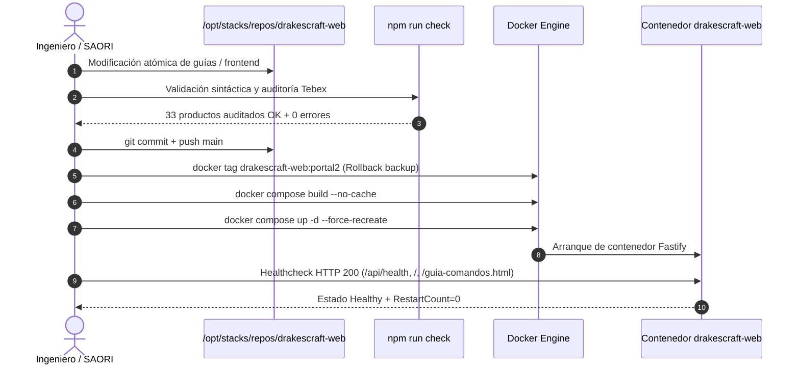

  

# DrakesCraft Web Portal & Shop Interface

> ### 🏰 ¡Únete a la Comunidad Oficial de DrakesCraft!
> 
> * 🎮 **IP del Servidor**: `play.drakescraft.cl` *(Java 1.21.11 & Bedrock)*
> * 💬 **Discord Oficial**: [discord.gg/drakescraft](https://discord.gg/rv3vtXZTk7)
> * 🌐 **Web & Guía**: [web.drakescraft.cl](https://web.drakescraft.cl) — 🛒 **Tienda**: [web.drakescraft.cl/store](https://web.drakescraft.cl/store.html)
> 
> *¡Juega con este addon y más de 80 expansiones optimizadas en vivo en nuestra network de supervivencia técnica!*

---

Portal web oficial, catálogo interactivo de la tienda Tebex y centro de guías completas para la comunidad de **DrakesCraft**. Mantenido por **DrakesCraft Labs**.

---

## 🎯 Objetivo

Ofrecer a la comunidad de jugadores una interfaz web de alto rendimiento, elegante y responsive para consultar el estado en vivo del servidor, manuales interactivos de comandos y Slimefun, escalafón de rangos y límites, métricas del ecosistema y catálogo de compras integrado de forma segura con la API de Tebex.

---

## 🏛️ Arquitectura del Sistema

---

## ⚡ Estructura del Sitio

- **Portal Principal (`index.html`)**:
  - Estado del servidor en tiempo real vía socket Ping, dirección IP (`mc.drakescraft.cl` / `play.drakescraft.cl`) y accesos comunitarios.
- **Centro de Guías Interactivas**:
  - `guia-comandos.html`: Manual interactivo de comandos organizados por modalidad con filtros en tiempo real, soporte Bedrock (`/offhand`) y alias.
  - `guia-rangos.html`: Comparativa de límites efectivos (hogares, protecciones, bóvedas, warps), kits y multiplicadores por rango.
  - `guia-slimefun.html`: Documentación viva de máquinas, reactores, circuitos y los más de 28 addons de Slimefun activos.
  - `guia.html`: Visión general de las 5 modalidades (Survival, Clásico, SkyBlock, OneBlock, Laboratorio).
- **Tienda Oficial & Catálogo (`catalog/store-catalog.js`)**:
  - Catálogo auditado con verificación estricta de 33 productos Tebex, precios en CLP/USD y pasarela protegida.
- **Métricas & Telemetría (`metricas.html`)**:
  - Datos de actividad, picos de jugadores y salud del ecosistema calculados periódicamente.

---

## 🛠️ Tecnologías y Despliegue

- **Frontend**: Vanilla HTML5, CSS3 moderno con variables HSL y arquitectura modular, JavaScript ES6+ nativo sin bundles pesados.
- **Backend**: Fastify 5 en Node.js 20+ ESM con `@fastify/static`.
- **Contenedorización**: Docker Compose sobre `/opt/stacks/drakescraft-web` con healthcheck automatizado.
- **Integraciones**: Tebex Headless API, Minecraft Server Ping protocol y telemetría Odysseia.

---

## ⚖️ Licencia y Créditos

- **Desarrollo y Mantenimiento**: DrakesCraft Labs & SAORI Autonomous Engineering Team.
- **Compatibilidad**: Diseñado para el ecosistema DrakesCraft (Paper / Purpur 1.21.11, Slimefun, Geyser/Floodgate).
- **Licencia**: MIT / GPL-3.0.
- **Código Fuente**: [GitHub Repository](https://github.com/DrakesCraft-Labs/drakescraft-web)
- **Soporte & Comunidad**: [GitHub Issues](https://github.com/DrakesCraft-Labs/drakescraft-web/issues) | [Discord Oficial](https://discord.gg/rv3vtXZTk7)

*Mantenido con ingeniería continua y observabilidad activa en Star VPS.*
