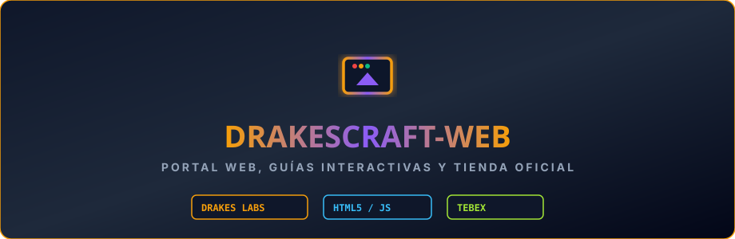

  

# DrakesCraft Web Portal & Shop Interface

> ### 🏰 ¡Únete a la Comunidad Oficial de DrakesCraft!
> 
> * 🎮 **IP del Servidor**: `play.drakescraft.net` *(Java 1.21.11 & Bedrock)*
> * 💬 **Discord Oficial**: [discord.gg/drakescraft](https://discord.gg/rR7FbfCt9Y)
> * 🌐 **Web & Guía**: [drakescraft.net](https://drakescraft.net) — 🛒 **Tienda**: [tienda.drakescraft.net](https://tienda.drakescraft.net)
> 
> *¡Juega con este addon y más de 80 expansiones optimizadas en vivo en nuestra network de supervivencia técnica!*

---

Portal web oficial, catálogo interactivo de la tienda Tebex y centro de guías completas para la comunidad de **DrakesCraft**. Mantenido por **DrakesCraft Labs**.

---

## 🎯 Objetivo

Ofrecer a la comunidad de jugadores una interfaz web rápida, elegante y responsive para consultar el estado del servidor, guías de comandos, tutoriales de Slimefun, escalafón de rangos y catálogo de compras integrado con Tebex Headless API.

---

## ⚡ Estructura del Sitio

- **Portal Principal (`index.html`)**:
  - Estado del servidor en tiempo real, dirección IP (`mc.drakescraft.cl`) y enlaces comunitarios.
- **Centro de Guías**:
  - `guia-comandos.html`: Manual interactivo con los 114 comandos del servidor clasificados por categoría.
  - `guia-rangos.html`: Comparativa de beneficios, kits y multiplicadores de rangos mortales, divinos y titánicos.
  - `guia-slimefun.html`: Documentación exhaustiva de máquinas, circuitos y addons activos.
- **Tienda Oficial & Catálogo (`catalog/store-catalog.js`)**:
  - Catálogo dinámico conectado con Tebex API para compras seguras en CLP / USD.
- **Métricas (`metricas.html`)**:
  - Telemetría de rendimiento y salud del servidor.

---

## 🛠️ Tecnologías y Despliegue

- **Frontend**: Vanilla HTML5, CSS3 moderno con variables HSL, JavaScript ES6+.
- **Servidor Web**: Contenedor Dockerizado con Nginx.
- **Integración**: Tebex Headless API & DiscordSRV.

## ⚖️ Upstream Attribution & License / Licencia y Créditos

- **Original Project / Upstream**: Slimefun4 Community Addon.
- **Port & Maintenance**: DrakesCraft Labs team (Compatibility for Paper / Purpur 1.21.11).
- **License**: GPL-3.0 / MIT.
- **Source Code**: [GitHub Repository](https://github.com/DrakesCraft-Labs/drakescraft-web)
- **Support & Issues**: [GitHub Issues](https://github.com/DrakesCraft-Labs/drakescraft-web/issues) | [Discord](https://discord.gg/rR7FbfCt9Y)

*This project is an open-source derivative work maintained by DrakesCraft Labs under the terms of its original license. All original assets and concepts belong to their respective creators.*
